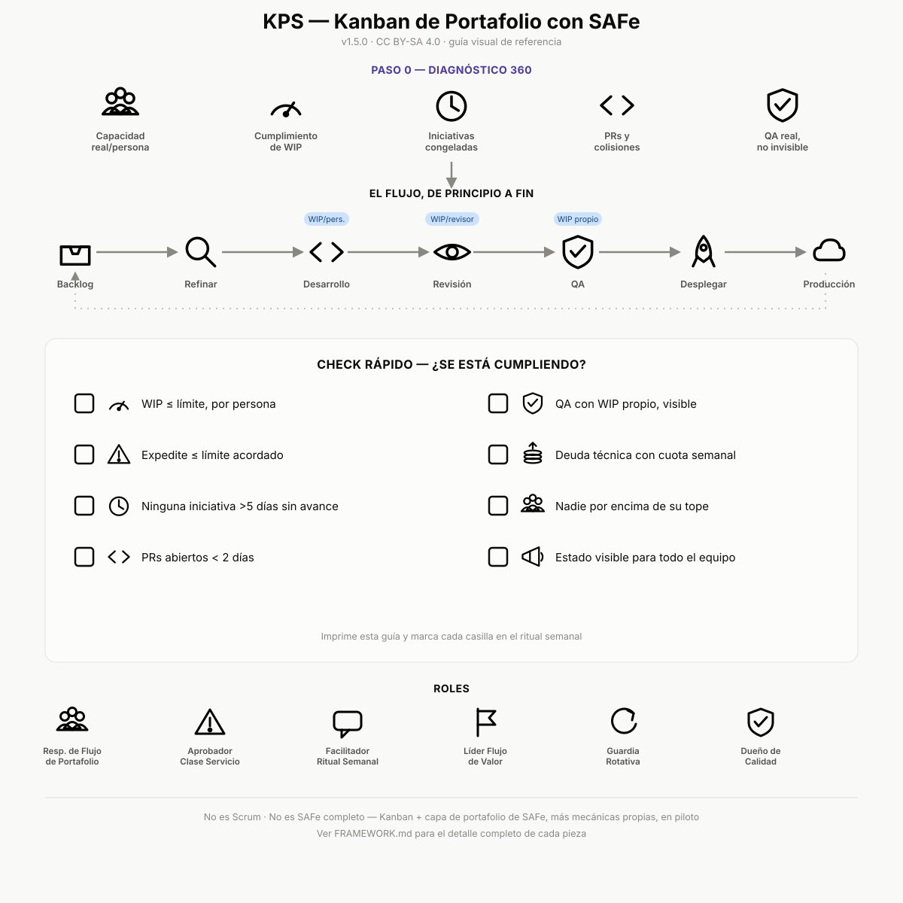

# KPS — Kanban de Portafolio con SAFe

> 🇬🇧 Reading in English? See [`FRAMEWORK.en.md`](./FRAMEWORK.en.md) for the full framework document.

Un framework abierto de gestión de trabajo para equipos que reparten personas entre varios proyectos, deuda técnica, soporte y mejoras, con prioridades que cambian cada semana.

Combina Kanban (flujo continuo, límites de trabajo en curso) con la capa de portafolio de SAFe (gestión de portafolio, priorización WSJF), más mecánicas propias para resolver la concentración de conocimiento en pocas personas y la congelación silenciosa de iniciativas cuando la capacidad se desvía a lo urgente.

## Empezar aquí

Lee [`FRAMEWORK.md`](./FRAMEWORK.md) — el documento completo, con:

- El problema que resuelve y por qué la base es Kanban + SAFe
- Los 7 pilares y las 5 mecánicas propias
- Roles y gobierno, con respaldo declarado para cada rol y una ruta de escalamiento para desacuerdos
- Cómo se gestionan los equipos por flujo de valor, cuándo usar freelances vs personal interno, cómo se manejan las dependencias entre flujos, y el onboarding de gente nueva o rotación interna
- Cómo entra QA sin convertirse en cuello de botella
- El flujo de infraestructura de principio a fin (ramas, PRs, CI/CD, ambientes, rollback)
- Sistema de medición completo: indicadores de flujo, capacidad, interrupción, deuda técnica, calidad y predictibilidad, mapeados a los desperdicios de Lean
- Apalancamiento con inteligencia artificial en la operación diaria del framework
- Presupuesto y dotación: cómo se conecta el costo de operar (mantener el negocio vs. cambiarlo) con la capacidad del portafolio
- Hoja de ruta de implementación paso a paso
- Anexos: SAFe en profundidad y glosario de términos

## Casos de aplicación real

- [Caso 1: Diagnóstico 360, ángulo de seguridad e infraestructura](./docs/caso-aplicacion-01-diagnostico-seguridad.md) (anonimizado)
- [Propuesta de piloto 1: de esos hallazgos al primer backlog KPS](./docs/propuesta-piloto-01.md) (anonimizado)

## Plantillas

- 📥 [Plan de implementación y seguimiento de proyectos](./docs/plan-implementacion.xlsx) (Excel, descargar) — hoja de ruta paso a paso más una hoja de seguimiento de proyectos con prioridad calculada automáticamente. En lenguaje de negocio, sin mencionar herramientas, lista para copiar y adaptar. GitHub no la previsualiza en el navegador por ser un archivo de Excel: haz clic en el enlace y luego en "Download raw file" (o el ícono de descarga) para abrirla en Excel, LibreOffice o Google Sheets.

## Estado

**Versión 1.13.0** — ver [`CHANGELOG.md`](./CHANGELOG.md) para el historial completo de cambios.

Este framework está pensado para crecer con el uso real en distintos equipos, no para quedar congelado en su primera versión. Si lo aplicas y encuentras algo que no funciona, que falta, o que se puede explicar mejor, ver [`CONTRIBUTING.md`](./CONTRIBUTING.md).

## Licencia

CC BY-SA 4.0 — puedes usar, adaptar y redistribuir este framework, incluso comercialmente, siempre que des crédito y mantengas las adaptaciones bajo la misma licencia. Ver [`LICENSE`](./LICENSE).
